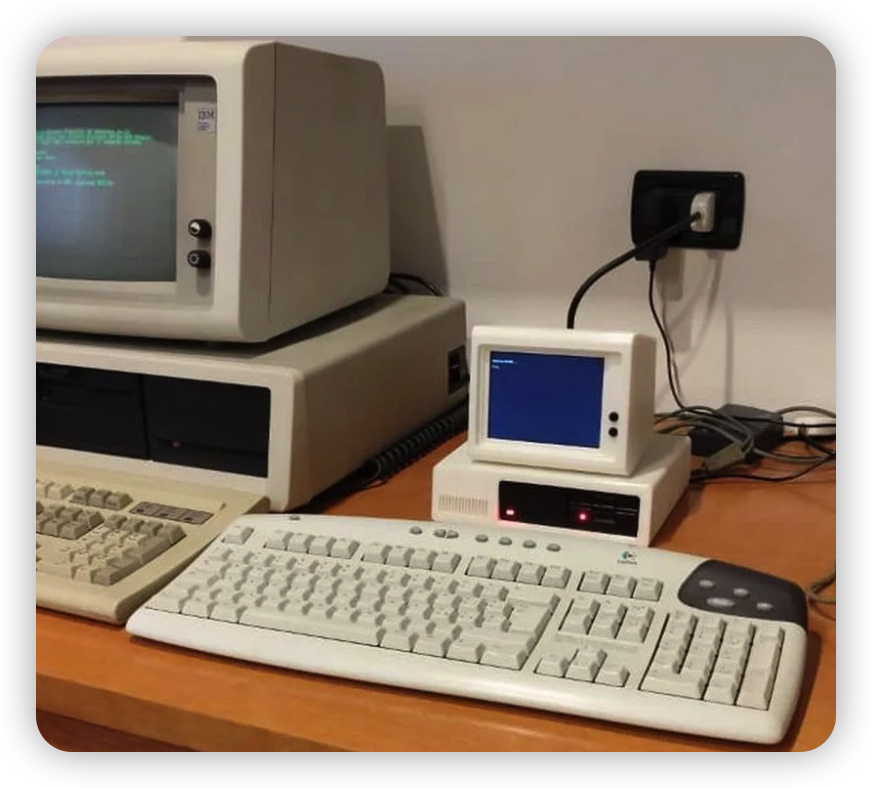

# Pico 2 MMBasic Workstation

A small, self-contained computer built around a **Raspberry Pi Pico 2 W** running
the **[MMBasic Anywhere](https://github.com/jvanderberg/PicoMiteAllVersions/)** firmware. With a built-in 5" HDMI display, a USB
keyboard, and 18650 battery power, it runs as a standalone, portable BASIC
workstation that boots in about a second. It has video out, an SD card for
program and file storage, and audio through a class-D amplifier and speaker.

This repo is the companion build guide for the YouTube video.


---

## What it does

- **640x480 video** on a built-in 5" HDMI panel, direct from the Pico
- **USB keyboard** input (the Pico acts as a USB host)
- **microSD storage** for your `.bas` programs and data files
- **Audio**: `PLAY`, `TONE`, and WAV playback through an I2S amp and speaker
- **Battery powered** off two 18650 cells
- Boots directly into the MMBasic prompt

---

## Parts list

> Prices are approximate (USD, early 2026) and will change. Links are to Adafruit
> where possible; most items are also available from Pimoroni, DigiKey, Amazon,
> and others.

| # | Part | Why | Approx. price | Link |
|---|------|-----|---------------|------|
| 1 | **Raspberry Pi Pico 2 W** (RP2350) | The main board. The "W" adds WiFi/BT; the plain Pico 2 also works if you don't need wireless. | **$7.00** | [raspberrypi.com](https://www.raspberrypi.com/products/raspberry-pi-pico-2/) / [Adafruit #6087](https://www.adafruit.com/product/6087) (no header) |
| 2 | **Adafruit DVI Sock for Pico** (#5957) | Solders to or clips onto the Pico and turns 8 GPIOs into an HDMI connector. | **$2.95** | [Adafruit #5957](https://www.adafruit.com/product/5957) |
| 3 | **Generic microSD SPI module** (3.3 V, 10-pack) | File storage over SPI. Cheap and plentiful, runs at 3.3 V. | **~$11 (10-pack)** | [Amazon (UMLIFE 10-pack)](https://www.amazon.com/UMLIFE-Interface-Conversion-Compatible-Raspberry/dp/B0989SM146/) |
| 4 | **Adafruit MAX98357A I2S Class-D Amp** (#3006) | Takes I2S audio from the Pico and drives a speaker. About 3 W into 4 ohm, 1.8 W into 8 ohm. | **$5.95** | [Adafruit #3006](https://www.adafruit.com/product/3006) |
| 5 | **Mini Metal Speaker, 8 ohm 0.5 W** (#1890) | The speaker. 28 mm round; any small 4-8 ohm speaker works. | **$1.95** | [Adafruit #1890](https://www.adafruit.com/product/1890) |
| 6 | **USB OTG / micro-USB host adapter** | Lets the Pico's micro-USB port host a full-size USB keyboard. | **~$2.95** | [Tiny OTG #2910](https://www.adafruit.com/product/2910) / [OTG cable #1099](https://www.adafruit.com/product/1099) |
| 7 | **USB keyboard** (wired) | Input. Wired keyboards are most reliable; some wireless dongles work. | **~$10-20** | (any) |
| 8 | **SD card** (full-size, 8-32 GB) | Storage media. Full-size pairs with the extender below. | **~$6** | (any) |
| 9 | **microSD-to-SD extender cable** (male microSD to female SD, screw tabs) | Plugs into the module's microSD socket and presents a full-size SD slot you can mount at the case edge. | **~$8 (4-pack)** | [Amazon](https://www.amazon.com/Extension-Material-Adapters-Designed-Conversion/dp/B0D8ZBQQ43) |
| 10 | **5" HDMI LCD**: ZJ050NA-08C 640x480 panel + HDMI/VGA/AV control board | Display. Native 640x480 matches MMBasic Anywhere's output. Runs on 12 V. | **~$24-28** | [AliExpress](https://www.aliexpress.us/item/3256801519462675.html) |
| 11 | **XL6009 DC-DC buck-boost converter** (4 A, 3.8-30 V to 1.25-35 V adj.), x2 | Two regulators off the battery: one set to 12 V (LCD), one to 5 V (Pico and amp). Sold in 3-packs. | **$3.30 / 3-pack** | [AliExpress](https://www.aliexpress.us/item/3256806984780680.html) |
| 12 | **2S 18650 battery holder** (series, ~7.4 V, wire leads) | Holds the cells; series output feeds both converters. | **~$7** | [Amazon](https://www.amazon.com/Battery-Holder-Batteries-Envistia-Mall/dp/B07N56GQ95) |
| 13 | **18650 Li-ion cells, x2** (genuine Samsung) | The power source. Buy genuine cells from a reputable seller. | **~$10-16** | [18650battery.com (Samsung)](https://18650battery.com/collections/samsung-18650-batteries) |
| 14 | **HDMI cable** (DVI Sock to LCD board) | Carries video from the Pico to the display. | **~$5** | (any) |
| 15 | **3D-printed case**: "Mini IBM PC (working clone!)" | Enclosure. Print and customize to suit; see Case below. | **filament, ~$1-3** | [Thingiverse](https://www.thingiverse.com/thing:7149915) |
| - | Hookup wire / perfboard or breadboard / solder | To connect everything. | **~$5** | (any) |

**Approx. total: ~$85-100** all-in, including the display and battery power. The
core compute, audio, and storage (rows 1-6) is about $25.

---

## How the pins are allocated

The RP2350's HSTX peripheral claims **GP12-GP19** for the DVI/HDMI signal pairs,
so those eight pins are not available for anything else. Everything else is
arranged around them:

| Function | Signal | Pico GPIO | Physical pin |
|----------|--------|-----------|--------------|
| **HDMI** (DVI Sock, fixed) | D0/CK/D1/D2 pairs | **GP12-GP19** | 16-25 |
| **SD card** (SPI) | SCK | GP10 | 14 |
| | MOSI (DI) | GP11 | 15 |
| | MISO (DO) | GP8 | 11 |
| | CS | GP9 | 12 |
| **Audio** (I2S) | BCLK | GP20 | 26 |
| | LRCLK (auto = BCLK+1) | GP21 | 27 |
| | DIN | GP22 | 29 |
| **Keyboard** | USB host | micro-USB connector | - |

> The SD and audio pins above are a conflict-free choice, not a hard requirement.
> You can pick different free pins as long as they avoid GP12-GP19, and update the
> `OPTION` commands to match. For I2S, LRCLK must be the GPIO immediately after
> BCLK (so GP20 then GP21 here).

---

## Wiring

### 1. DVI Sock to Pico
The DVI Sock mounts directly on top of the Pico (it lines up with GP12-GP19 and
several grounds). Solder it on, or use the castellated pads / headers. No jumper
wires needed; just run an HDMI cable from the Sock to the display.

### 2. microSD module to Pico

| SD module | Pico |
|-----------|------|
| `SCK` / `CLK` | GP10 (pin 14) |
| `MOSI` | GP11 (pin 15) |
| `MISO` | GP8 (pin 11) |
| `CS` | GP9 (pin 12) |
| `VCC` | 3V3 OUT (pin 36) |
| `GND` | any GND |

To make the card swappable from outside the case, plug a microSD-to-SD extender
into the module's socket and mount the full-size SD slot at the case edge. It is
electrically the same SPI connection, so no wiring or config changes.

### 3. MAX98357A amp to Pico

| MAX98357A | Pico |
|-----------|------|
| `BCLK` | GP20 (pin 26) |
| `LRC`  | GP21 (pin 27) |
| `DIN`  | GP22 (pin 29) |
| `Vin`  | 5 V rail (XL6009 #2 output / Pico VBUS). Drive Vin at 5 V for full output. |
| `GND`  | any GND |
| `GAIN` | leave floating for 9 dB (default), or tie to set 3/6/9/12/15 dB |
| `SD`   | leave floating; outputs (Left+Right)/2 (mono mix) |

### 4. Speaker to MAX98357A
Connect the speaker to the amp's screw terminals or `+`/`-` pads. Polarity does
not matter for a single speaker.

### 5. USB keyboard
Plug the OTG adapter into the Pico's micro-USB port, then plug the keyboard into
the adapter. MMBasic Anywhere detects USB HID keyboards automatically.

### 6. Display
Run an HDMI cable from the DVI Sock to the LCD control board's HDMI input. Power
the control board from 12 V (XL6009 #1); see below. The ZJ050NA-08C is natively
640x480, so MMBasic Anywhere's output maps 1:1 with no scaling.

### 7. Power: battery and two converters
The build runs off two 18650 cells in series (~7.4 V nominal, 6.0-8.4 V over the
discharge range) feeding two XL6009 buck-boost converters:

```
2S 18650 pack (~7.4 V)
   |-- XL6009 #1, set to 12 V --> LCD control board (12 V in)
   |-- XL6009 #2, set to  5 V --> Pico VBUS (pin 40) + MAX98357A Vin
   pack GND -------------------> common GND (LCD, Pico pin 38, amp)
```

Set each converter's output voltage before connecting its load: power the XL6009
from the pack, put a multimeter on its output, and turn the trim-pot until you
read 12.0 V (converter #1) and 5.0 V (converter #2). Then wire the loads.

Feed 5 V to VBUS (pin 40), not VSYS. Because the Pico is acting as the USB host
for the keyboard, the keyboard draws its power from the Pico's VBUS rail, which a
host PC would normally supply. With no PC attached, the 5 V converter supplies
VBUS, which powers the keyboard and back-feeds VSYS through the Pico's onboard
Schottky diode to run the Pico. A single 5 V rail powers the keyboard and the
Pico.

> Tie all grounds together: battery, both converters, the LCD board, the Pico,
> and the amp share a common ground.
>
> Note: a bare 2S holder has no charge protection or balancing. For a finished
> build, add a 2S BMS or protection board, or use a 2S charge-and-protect module.
> At minimum, use protected cells and a proper 2S charger, and do not charge
> unbalanced Li-ion unattended.

---

## Case



A 3D-printed enclosure holds everything together. This build uses the
[Mini IBM PC (working clone!)](https://www.thingiverse.com/thing:7149915) model
on Thingiverse. Print it and customize it to suit your own layout, drilling or
cutting openings where you need them:

- Expose the SD card slot at an edge using the microSD-to-SD extender, so you can
  swap cards without opening the case.
- Add a port for the USB keyboard's OTG connector.
- Expose the display control board's buttons (menu, brightness), or leave them
  inside if you do not need them.

Treat the model as a starting point and adapt the cutouts to the exact boards and
connector positions you end up with.

---

## Flashing the firmware

1. Download the firmware UF2:
   **[`PicoMite-DVIWIFIRP2350.uf2`](https://github.com/jvanderberg/PicoMiteAllVersions/releases/download/latest/PicoMite-DVIWIFIRP2350.uf2)**
2. Hold the **BOOTSEL** button on the Pico while plugging it into your PC's USB
   port. It mounts as a drive called **RPI-RP2**.
3. Drag the `.uf2` file onto that drive. The Pico reboots into MMBasic.

(After this, the USB port returns to keyboard-host duty and the board runs on
battery power via VBUS as described above.)

---

## First boot and configuration

With the display and USB keyboard connected, power on. You should land at the `>`
MMBasic prompt. Enter these `OPTION` commands once. They are saved to flash and
persist across reboots (the Pico reboots after each one):

```basic
' SD card: OPTION SDCARD CSpin, CLKpin, MOSIpin, MISOpin
OPTION SDCARD GP9, GP10, GP11, GP8

' I2S audio (MAX98357A): OPTION AUDIO I2S BCLKpin, DINpin
OPTION AUDIO I2S GP20, GP22         ' BCLK=GP20, DIN=GP22, LRCLK auto = GP21
```

The display needs no configuration. The HDMI build boots into MODE 1 (640x480,
monochrome, about 80x40 text) automatically. For colour, switch with `MODE 3`
(640x480, 16 colours); `FONT` changes the text size.

Check it worked:

```basic
LIST OPTION        ' shows your saved configuration
FILES              ' lists the SD card contents
PLAY TONE 440, 440, 1000   ' 1-second A440 beep through the speaker
```

> `OPTION SDCARD` takes the four SPI pins directly (CS, CLK, MOSI, MISO); none may
> use GP12-GP19 (claimed by HDMI). The layout above respects that.

---

## Hello, world

```basic
10 CLS
20 PRINT "Hello from MMBasic on a Pico 2!"
30 FOR i = 1 TO 10
40   PRINT "Line "; i
50 NEXT i
60 PLAY TONE 880, 880, 200
```

Type `RUN` to run it. Save it to the SD card with `SAVE "HELLO.BAS"`.

---

## Troubleshooting

- **No video**: confirm the LCD control board is getting 12 V (check XL6009 #1
  with a meter), the DVI Sock is seated and soldered correctly, and the board is
  on its HDMI input. Try a different cable; some long or cheap HDMI cables do not
  pass the Pico's signal cleanly.
- **Keyboard does nothing**: use a wired USB keyboard (or a compatible wireless
  dongle) through the OTG adapter, and make sure the Pico has 5 V on VBUS (from
  XL6009 #2) to power both the keyboard and itself.
- **`FILES` errors or card not found**: recheck the SPI wiring, make sure the
  card is FAT32-formatted, and confirm the `OPTION SDCARD` pins (CS, CLK, MOSI,
  MISO) match your wiring.
- **No sound**: verify `Vin` is at 5 V, the I2S pins match the `OPTION AUDIO`
  command, and `LRCLK` is wired to GP21 (BCLK + 1).

---

## Demos and examples

- [`demos/`](demos/) - MMBasic programs to copy to the SD card: games (Picoblocks,
  PicoVaders, Pong), graphics, sound, and benchmarks. See [demos/README.md](demos/README.md).
- [`webserver/`](webserver/) - a WiFi HTTP server in MMBasic with HTML/CSS assets.
  See [webserver/README.md](webserver/README.md).

---

## References

- [PicoMite User Manual (Geoff Graham)](https://geoffg.net/picomite.html)
- [Firmware releases (this fork)](https://github.com/jvanderberg/PicoMiteAllVersions/releases)
- [Adafruit DVI Sock guide](https://learn.adafruit.com/adafruit-dvi-sock-for-pico)
- [Adafruit MAX98357A guide](https://learn.adafruit.com/adafruit-max98357-i2s-class-d-mono-amp)
